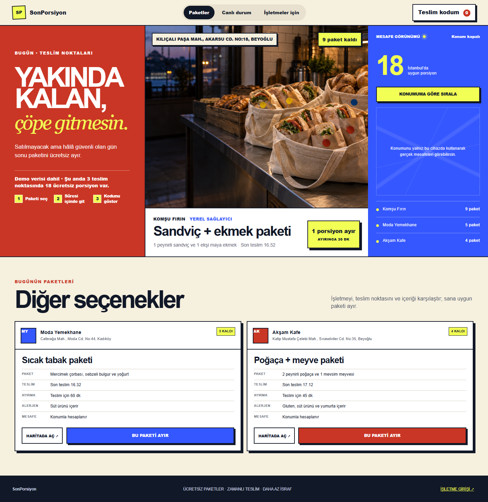
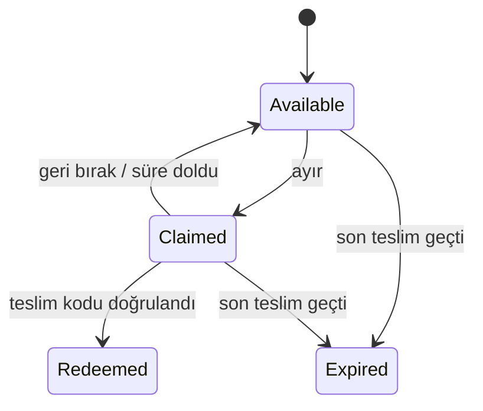
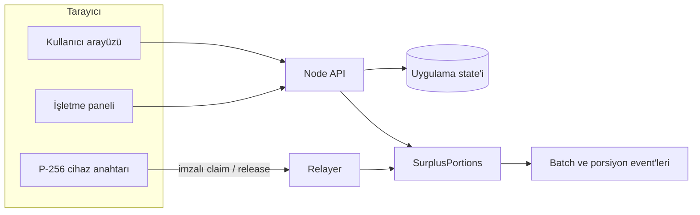
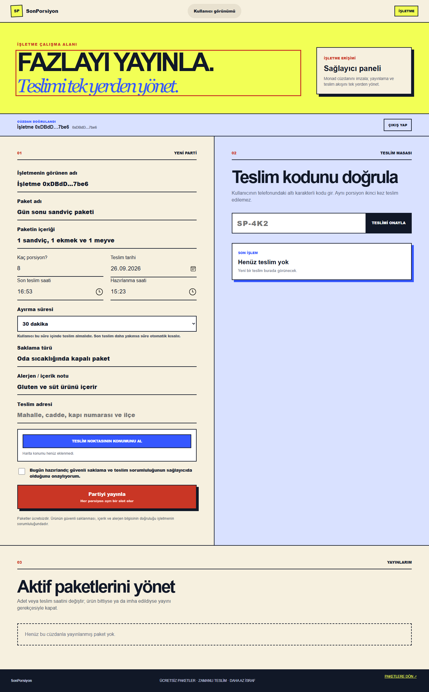

# SonPorsiyon

SonPorsiyon, gün sonunda satılmayacak fakat hâlâ güvenli olan porsiyonların yakındaki insanlar tarafından ücretsiz ayrılmasını ve zamanında teslim alınmasını sağlayan bir teslim ağıdır.

İşletme fazlayı yayınlar, kullanıcı bir porsiyonu süreli olarak ayırır ve teslim kodu işletmede yalnız bir kez kapatılır. Ödeme, token veya yardım uygunluğu süreci yoktur.



## Ürün akışı

1. İşletme paket içeriğini, adedi, teslim noktasını ve ayırma süresini yayınlar.
2. Her fiziksel porsiyon ayrı bir dijital slot olarak oluşturulur.
3. Kullanıcı yakındaki bir paketi hesap veya cüzdan açmadan ayırır.
4. Kullanıcı süre içinde teslim kodunu gösterir ya da hakkını geri bırakır.
5. İşletme kodu doğruladığında aynı porsiyon ikinci kez teslim edilemez.



## Monad entegrasyonu

Monad yalnız oturum açma imzası için kullanılmaz. Ürünün temel teslim hakkı akışı kontrata yazılır.

| Ürün işlemi | Monad işlemi | İmzalayan / gönderen |
|---|---|---|
| İşletme paket yayınlar | `createBatch` | İşletme servisi |
| Kullanıcı porsiyon ayırır | `claimWithP256` | Cihaz P-256 imzası, işlemi relayer gönderir |
| Kullanıcı hakkını bırakır | `releaseWithP256` | Cihaz P-256 imzası, işlemi relayer gönderir |
| İşletme teslimi tamamlar | `redeem` | İşletme servisi |

Kullanıcının tarayıcısında çıkarılamayan bir P-256 cihaz anahtarı oluşturulur. İmza, Monad'ın `0x0100` adresindeki EIP-7951 doğrulayıcısıyla kontrat içinde kontrol edilir. Relayer gas ücretini ödediği için kullanıcı cüzdan kurmadan işlem yapabilir.

Her `batchId/slotId` bağımsız state taşır. Bu yapı farklı porsiyonların paralel ilerlemesine izin verirken aynı porsiyonun yalnız tek kesin durumda kalmasını sağlar.

Kontrat kaynak kodu: [`contracts/SurplusPortions.sol`](contracts/SurplusPortions.sol)

## Onchain kanıt

| Alan | Değer |
|---|---|
| Ağ | Monad Testnet |
| Chain ID | `10143` |
| Kontrat | [`0x3727Cc6eBc90C0a05Acff9475A507FBFf7D19e9f`](https://testnet.monadvision.com/address/0x3727Cc6eBc90C0a05Acff9475A507FBFf7D19e9f) |
| Deploy işlemi | [`0x2deb9d5c...2378db9`](https://testnet.monadvision.com/tx/0x2deb9d5c51f6ea074f19968ab84592e769226e239b93967a71d71bf162378db9) |
| Runtime bytecode | 6.908 bayt, `eth_getCode` ile doğrulandı |

Kontrat seviyesinde iki ayrı P-256 cihaz kimliğiyle doğrulanan akış:

| Adım | İşlem |
|---|---|
| Batch oluşturma | [`0x6b0126de...0c272a`](https://testnet.monadvision.com/tx/0x6b0126de99d2f6c701082f2bd66f453df6f0a3b87fb0990a35e544bfe10c272a) |
| Birinci cihaz claim | [`0xd3f13421...76d3d4`](https://testnet.monadvision.com/tx/0xd3f13421738b338fdd47d36ab675898cdde7ff3e427e75c090341ff0c876d3d4) |
| Birinci cihaz release | [`0x7b79c6d0...d7da7c`](https://testnet.monadvision.com/tx/0x7b79c6d0aa43bd97bdcbfa072826f869c8d7a0c4b899312f1934db2d88d7da7c) |
| İkinci cihaz claim | [`0x49939d61...f41477`](https://testnet.monadvision.com/tx/0x49939d619a2025a82f071aa837bf618a0868ebc0e2f68340db52b5defcf41477) |
| İşletme redeem | [`0x49104811...36b008`](https://testnet.monadvision.com/tx/0x4910481110aa46415bd714c98bb683d6cd7e301fe15c1d95d23a3da51936b008) |

Tarayıcı arayüzünden tamamlanan yayın, ayırma ve teslim turu:

| Ekran işlemi | Monad işlemi |
|---|---|
| İşletme ekranından yayın | [`0x94068a8f...2aa944`](https://testnet.monadvision.com/tx/0x94068a8fa202540730249dc8b9290afb1af4ae454543dcabc410c3af1b2aa944) |
| Tüketici ekranından P-256 claim | [`0x4cbcaf30...af117c`](https://testnet.monadvision.com/tx/0x4cbcaf30456696d17e7326f4c443d6693496749e7830fe7eee59b8c393af117c) |
| İşletme ekranından kodla redeem | [`0x653f9164...adf53b`](https://testnet.monadvision.com/tx/0x653f9164d5a32230c06bbe7983004cbfd6991cca6e426177da9c32700badf53b) |

Ayrıntılı kayıt: [`docs/MONAD_TESTNET_DEPLOYMENT.md`](docs/MONAD_TESTNET_DEPLOYMENT.md)

## Mimari



Node API, Monad ortam değişkenleri tanımlandığında yayın, ayırma, bırakma ve teslim işlemlerini Testnet'e gönderir. Ayarlar bulunmadığında aynı ürün akışı yerel geliştirme modunda çalışır.

Cloudflare Worker sürümü D1 üzerinde kalıcı ürün akışını sağlar. Mevcut onchain köprü Node runtime içindedir.

## Çalışan özellikler

- Çoklu işletme ve ortak porsiyon stoğu
- İşletme bazlı 15, 30, 45 veya 60 dakika ayırma süresi
- Son teslim yaklaşınca otomatik kısalan ayırma süresi
- Cihaz başına ağ genelinde tek aktif ayırma
- Tek kullanımlık teslim kodu ve süre sonunda otomatik geri açılma
- Konuma göre teslim noktası sıralaması
- Yayın düzenleme, gerekçeli kapatma ve kullanıcı bildirimi
- İşletme cüzdan imzası ve ayrı oturum
- Monad Testnet yayın, P-256 claim/release ve redeem işlemleri
- Masaüstü ve mobil kullanıcı akışı



## Yerelde çalıştırma

Gereksinim: Node.js 20+

```bash
npm install
npm test
npm start
```

- Kullanıcı: `http://127.0.0.1:4177`
- İşletme: `http://127.0.0.1:4177/isletme`

## Monad Testnet yapılandırması

Özel anahtarları repoya eklemeyin. Değerleri yalnız yerel ortam değişkenlerinde veya bir secret manager içinde tutun.

```powershell
$env:MONAD_RPC_URL="https://testnet-rpc.monad.xyz"
$env:MONAD_CHAIN_ID="10143"
$env:MONAD_EXPLORER_URL="https://testnet.monadvision.com"
$env:DEPLOYER_PRIVATE_KEY="..."
$env:RELAYER_PRIVATE_KEY="..."
```

Yeni kontrat deploy etmek için:

```powershell
npm run deploy:monad
$env:MONAD_CONTRACT_ADDRESS="0x..."
```

Zincir ve arayüz akışlarını doğrulamak için:

```powershell
npm run e2e:monad
npm start
npm run e2e:monad-ui
```

## Testler

```bash
npm test
```

Test paketi Solidity derlemesini, P-256 mesaj ve imza doğrulamasını, API/Worker davranışını, iki tarayıcı bağlamındaki ortak stoğu, yayın/claim/release/redeem akışını ve mobil yerleşimi kapsar.

## Güven sınırı

Zincir dijital teslim hakkının durumunu kanıtlar. Yemeğin fiziksel varlığını, güvenliğini veya gerçekten teslim edildiğini tek başına kanıtlamaz. Gıda güvenliği, alerjen ve saklama bilgilerinin doğruluğu sağlayıcının sorumluluğundadır; kişisel veri zincire yazılmaz.

Pilot ve mevzuat çerçevesi: [`REGULASYON_VE_PILOT.md`](REGULASYON_VE_PILOT.md)

## Proje yapısı

```text
web/          tarayıcı arayüzü
worker/       Cloudflare Worker API
db/           Drizzle şeması
drizzle/      D1 migration dosyaları
contracts/    Solidity durum makinesi
lib/          Monad işlem köprüsü
scripts/      derleme, deploy ve uçtan uca test araçları
tests/        tarayıcı ve Worker testleri
server.mjs    Node geliştirme sunucusu
```

## Teknik kaynaklar

- [Monad network information](https://docs.monad.xyz/developer-essentials/network-information)
- [Monad precompiles](https://docs.monad.xyz/developer-essentials/precompiles)
- [Monad parallel execution](https://docs.monad.xyz/monad-arch/execution/parallel-execution)
- [EIP-7951](https://eips.ethereum.org/EIPS/eip-7951)
- [Görsel kaynakları](docs/ASSET_SOURCES.md)
